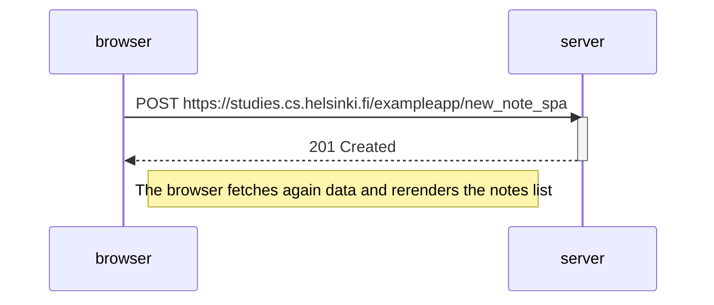

Here is the diagram for sending the new note with the form in the single page app, assuming that I was already in that page:

```mermaid
sequenceDiagram
    participant browser
    participant server

    browser->>server: POST https://studies.cs.helsinki.fi/exampleapp/new_note_spa
    activate server
    server-->>browser: 201 Created
    deactivate server

    Note right of browser: The browser fetches again data and rerenders the notes list
```